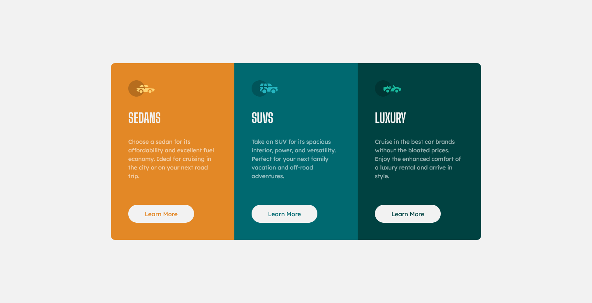
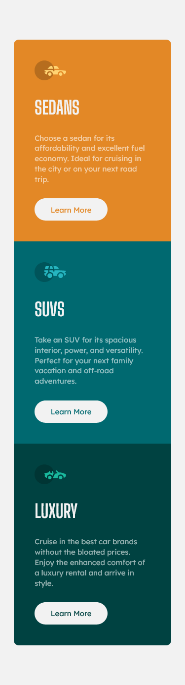

# Frontend Mentor - 3-column preview card component solution

This is a solution to the [3-column preview card component challenge on Frontend Mentor](https://www.frontendmentor.io/challenges/3column-preview-card-component-pH92eAR2-). Frontend Mentor challenges help you improve your coding skills by building realistic projects.

## Table of contents

- [Screenshot](#screenshot)
- [Links](#links)

- [Built with](#built-with)

- [Author](#author)

### Screenshot

### Links

- Solution URL: [Add solution URL here](https://www.frontendmentor.io/solutions/3column-preview-card-component-using-html-css-fvq7tLyBq)
- Live Site URL: [Add live site URL here](https://robin-anmol.github.io/3-column-card-component/)

### Built with

- Semantic HTML5 markup
- CSS custom properties
- Flexbox

-- I am using firefox browser for development!!

## Author

- Linkedln - [Anmol Gangwar](https://www.linkedin.com/in/anmol-gangwar-8247291ba/)
- Frontend Mentor - [@Robin-Anmol](https://www.frontendmentor.io/profile/Robin-Anmol)
